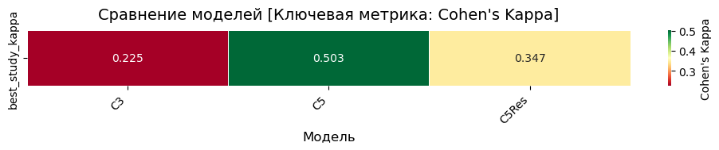
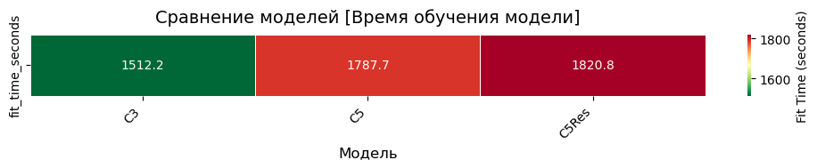
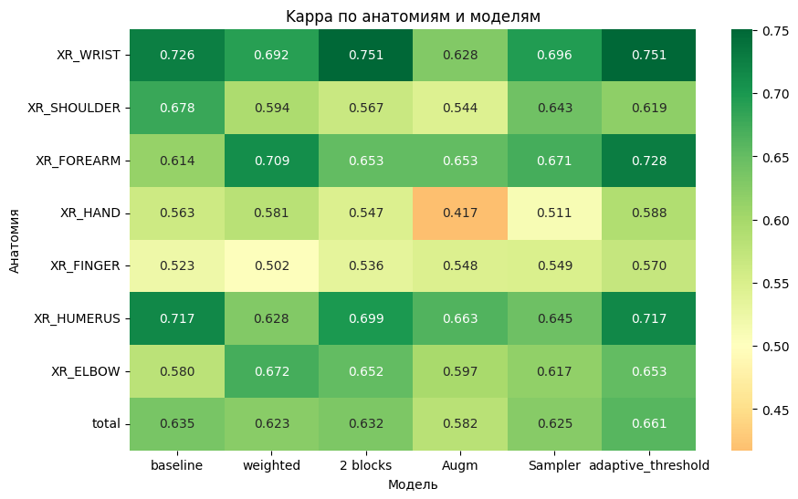
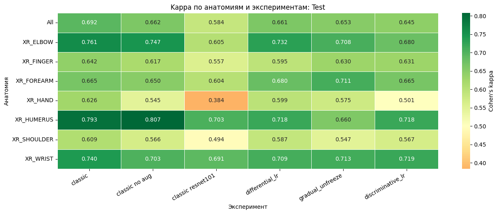
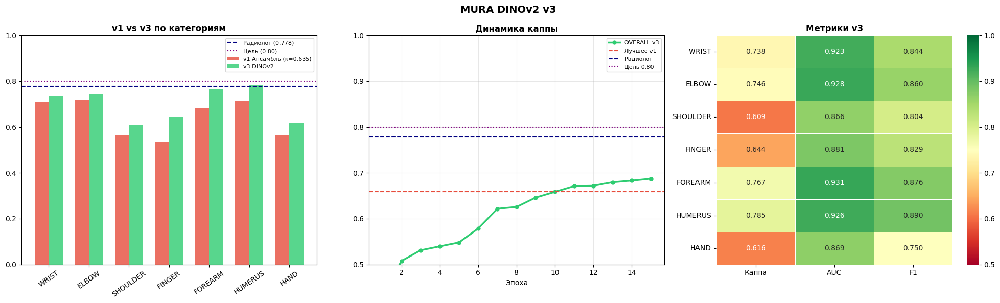
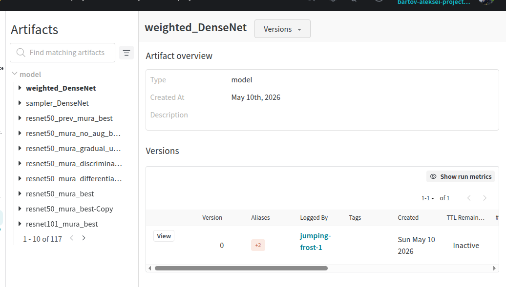
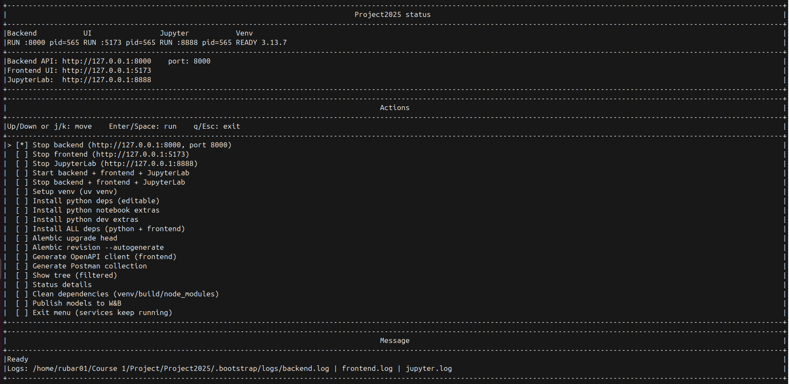

# DL experiments по MURA

> 🧭 [README](README.md) · **Чекпойнт 6 — Deep Learning** · ← [CP5 · ML-эксперименты](ML_Experiments.ipynb) · [CP7 · MLflow](MLflow_Checkpoint_MURA.md) →

- [DL experiments по MURA](#dl-experiments-по-mura)
  - [Общее описание экспериментов и юпитер-тетрадок](#общее-описание-экспериментов-и-юпитер-тетрадок)
  - [Custom CNN Baseline (C3 / C5 / C5Res)](#custom-cnn-baseline-c3--c5--c5res)
    - [Общий pipeline](#общий-pipeline)
    - [Архитектуры](#архитектуры)
      - [C3 (3 сверточных слоя)](#c3-3-сверточных-слоя)
      - [C5 (5 сверточных блоков)](#c5-5-сверточных-блоков)
      - [C5Res (C5 с residual связью)](#c5res-c5-с-residual-связью)
    - [Результаты экспериментов](#результаты-эксперименотов)
    - [Вывод](#вывод)
  - [DenseNet121](#densenet121)
    - [Общий pipeline](#общий-pipeline-1)
    - [Эксперименты](#эксперименты)
    - [Kappa по анатомиям](#kappa-по-анатомиям)
  - [ResNet50 / ResNet101](#resnet50--resnet101)
    - [Общий pipeline](#общий-pipeline-2)
    - [Эксперименты](#эксперименты-1)
    - [Study-level test](#study-level-test)
  - [DINOv2-Large SimpleMURA](#dinov2-large-simplemura)
    - [Общий pipeline](#общий-pipeline-3)
    - [Архитектура](#архитектура)
    - [Аугментации, loss и оптимизация](#аугментации-loss-и-оптимизация)
    - [Динамика обучения](#динамика-обучения)
    - [Финальная оценка без TTA](#финальная-оценка-без-tta)
  - [Сравнение времени и вычислительной цены](#сравнение-времени-и-вычислительной-цены)
  - [Общее сравнение baseline, ML и DL](#общее-сравнение-baseline-ml-и-dl)
  - [Лучшее DL-решение](#лучшее-dl-решение)
  - [W\&B и bootstrap script updates](#wb-и-bootstrap-script-updates)

## Общее описание экспериментов и юпитер-тетрадок

Основные ноутбуки:
- [DL_Experiments_CNN_baseline3.ipynb](./notebooks/DL_Experiments_CNN_baseline3.ipynb)
- [DL_Experiments_densenet.ipynb](./notebooks/DL_Experiments_densenet.ipynb)
- [DL_Experiments_RESNET_collab_ver_3.ipynb](./notebooks/DL_Experiments_RESNET_collab_ver_3.ipynb)
- [DL_Experiments_MURA_DINOv2_Adapters_v3.ipynb](./notebooks/DL_Experiments_MURA_DINOv2_Adapters_v3.ipynb)

Основная метрика(как и прежде): **Cohen's kappa**. Дополнительно считались accuracy, ROC-AUC, PR-AUC и F1.

Важное замечание для сравнения: DenseNet и ResNet считают основную финальную метрику на уровне исследования (`study`): вероятности снимков одного исследования агрегируются, после чего считается kappa. DINOv2 в сохранённом output оценивается по строкам `valid.csv`, то есть по изображениям. Поэтому DINOv2 и study-level модели сравнимы по направлению качества, но не идеально один-в-один.
## Custom CNN Baseline (C3 / C5 / C5Res)

### Общий pipeline

- Данные: MURA-enhanced, 224×224, grayscale (1 канал).
- Train: ~36,808 изображений, Valid: ~3,197 изображений.
- Study-level агрегация: unique_study_id = patient_id + "_" + study_id; вероятности снимков одного исследования усредняются - перед расчётом kappa.
- Batch size: 64 (тестировались 96/128/192 для оценки влияния на стабильность).
- Epochs: 15.
- Loss: BCEWithLogitsLoss(pos_weight=1.457) — вес подобран по дисбалансу классов в трейне.
- Optimizer: Adam(lr=3e-4), scheduler не использовался.
- Аугментации (train): RandomHorizontalFlip, RandomRotation(10), ToTensor.
- Валидация: без аугментаций, только Resize + ToTensor.
- Метрики: Cohen's kappa (study-level и image-level), accuracy, порог подбирался перебором на валидации (thr ∈ [0.30, 0.70]).
- Оптимизации: pin_memory=True, non_blocking=True, torch.inference_mode(), zero_grad(set_to_none=True).

### Архитектуры
#### C3 (3 сверточных слоя)
Простая архитектура с тремя сверточными слоями:
- Conv(1→32) → Conv(32→64) → Conv(64→128)
- MaxPool(2) после каждого слоя
- AdaptiveAvgPool + FC(128→1)
- **Параметров:** ~2.1M

#### C5 (5 сверточных блоков)
Более глубокая сеть с batch normalization и dropout:
- 5 блоков: Conv + BatchNorm + ReLU + MaxPool + Dropout(0.2)
- Progressive увеличение каналов: 32→64→128→256→256
- AdaptiveAvgPool + FC(256→1)
- **Параметров:** ~4.8M

#### C5Res (C5 с residual связью)
Модификация C5 с skip-connection:
- Аналогична C5, но с residual связью после 2-го пулинга
- Projection shortcut: AvgPool(4) + Conv1x1 для согласования размерностей
- **Параметров:** ~4.9M

### Результаты эксперименотов
Анатомия        |  C3    |   C5   | C5Res  |
----------------|--------|--------|--------|
XR_ELBOW        | 0.346  | 0.321  | 0.287  |
XR_FINGER       | 0.457  | 0.373  | 0.402  |
XR_FOREARM      | 0.190  | 0.545  | 0.382  |
XR_HAND         | 0.300  | 0.277  | 0.282  |
XR_HUMERUS      | 0.062  | 0.453  | 0.257  |
XR_SHOULDER     | 0.066  | 0.236  | 0.306  |
XR_WRIST        | 0.268  | 0.467  | 0.385  |

### Вывод 
Использование даже неглубоких сверток дает сильные результаты в сравнении с ML-подходами и дает лучшие метрики. Несмотря на то, что даже тут можно еще использовать аугментации, нарастить глубину для улучшения результатов, разумно продолжить эксперименты с предобученными моделями для достижения лучшего результата.

## DenseNet121

Источник: [DL_Experiments_densenet.ipynb](./notebooks/DL_Experiments_densenet.ipynb)

### Общий pipeline

- В ноутбуке загружено `37,108` изображений.
- Размер изображений - 224x224.
- Для каждого изображения формируется `unique_study_id = patient_id + "_" + study_id`.
- Validation-предсказания агрегируются на уровень исследования: средняя вероятность по всем снимкам одного `study_id`.
- Batch size: `64`.
- Train loader: `533` батча, validation loader: `48` батчей.
- Loss: `BCEWithLogitsLoss`, кроме weighted-эксперимента.
- Optimizer: `Adam`.
- Scheduler не использовался.
- Early stopping реализован через patience, но best checkpoint в цикле не восстанавливается; финальные метрики считаются на состоянии модели после остановки.

### Эксперименты

| Эксперимент | Архитектура и обучение | Threshold | Accuracy | AUC | Kappa |
|---|---|---:|---:|---:|---:|
| Baseline | `DenseNet121` ImageNet; заморожено всё, кроме `denseblock4` и `classifier`; `Adam(lr=1e-5)` | 0.4774 | 0.8204 | 0.8817 | 0.6355 |
| Weighted loss | Как baseline, но `pos_weight=1.1297` в `BCEWithLogitsLoss` | 0.4070 | 0.8122 | 0.8728 | 0.6232 |
| 2 blocks | Разморожены `denseblock3`, `denseblock4`, `classifier`; feature LR `1e-6`, classifier LR `1e-5` | 0.4874 | 0.8184 | 0.8756 | 0.6316 |
| Targeted augmentation | 2 blocks + усиленная аугментация для `XR_SHOULDER`, `XR_HAND`, `XR_FINGER` | 0.4121 | 0.7936 | 0.8628 | 0.5818 |
| Oversampling | 2 blocks + `WeightedRandomSampler`, вес `2.0` для слабых анатомий | 0.4171 | 0.8142 | 0.8698 | 0.6246 |
| Adaptive threshold | Загружен `blocks2_DenseNet.pth`, threshold подобран отдельно для каждой анатомии | per anatomy | - | - | 0.6622 |

Targeted augmentation использовала `RandomHorizontalFlip`, `RandomRotation(10)`, `RandomAffine(translate=(0.03, 0.03))`, `ColorJitter(0.05, 0.05)`, `ToTensor`, `Normalize([0.485]*3, [0.229]*3)`. Для остальных экспериментов train/val transform был только `ToTensor + Normalize`.

Итоговая heatmap kappa из ноутбука:

### Kappa по анатомиям

| Категория | Baseline | Weighted | 2 blocks | Augmented | Sampler | Adaptive threshold |
|---|---:|---:|---:|---:|---:|---:|
| XR_WRIST | 0.7265 | 0.6916 | 0.7510 | 0.6284 | 0.6960 | 0.7510 |
| XR_SHOULDER | 0.6780 | 0.5942 | 0.5670 | 0.5442 | 0.6425 | 0.6186 |
| XR_FOREARM | 0.6139 | 0.7093 | 0.6529 | 0.6525 | 0.6713 | 0.7279 |
| XR_HAND | 0.5627 | 0.5806 | 0.5473 | 0.4174 | 0.5107 | 0.5883 |
| XR_FINGER | 0.5232 | 0.5024 | 0.5357 | 0.5477 | 0.5486 | 0.5703 |
| XR_HUMERUS | 0.7169 | 0.6275 | 0.6990 | 0.6633 | 0.6454 | 0.7169 |
| XR_ELBOW | 0.5796 | 0.6722 | 0.6525 | 0.5969 | 0.6167 | 0.6527 |

Вывод по DenseNet: baseline уже дал сильный результат относительно ML-подходов. Усложнение разморозки до двух блоков помогло отдельным анатомиям (`XR_WRIST`, `XR_FINGER`), но не улучшило overall kappa относительно baseline. Weighted loss и oversampling улучшали часть дисбалансных анатомий, но не дали устойчивого overall-прироста. Лучшее число `0.6622` получено через per-anatomy threshold, однако этот threshold подбирался и оценивался на одном validation set, поэтому результат может быть оптимистичным.

## ResNet50 / ResNet101

Источник:  
[DL_Experiments_RESNET_collab_ver_3.ipynb](./notebooks/DL_Experiments_RESNET_collab_ver_3.ipynb)  

Было сделано несколько прогонов с ResNet, в выбранной версии итоговая метрика получилась лучше всего, 

- DL_Experiments_ver_2
  - Не было 101
  - МОдель не отбиралась по composite metrics
- DL_Experiments_ver_3
    - Scheduler шаг делался по каппа а не composite metric
    - Модель отбиралась по composite metric
    - была утечка памяти про сохранении результатов трейна (всё оставалось на гпу)
    - лоадер для 101 оставался с 750 батчами
- DL_Experiments_ver_4
    - torch no grad -> torch inference mode
    - Шаг scheduler по composite metric
- DL_Experiments_ver_5
    - Подбор модели по pr_auc

### Общий pipeline

- Размер изображений: 224x224.
- Train: `36,808` изображений, `13,457` studies.
- Original `valid/` используется как финальный test: `3,197` изображений, `1,199` studies.
- Из `train/` выделяется internal validation по `study` через `GroupShuffleSplit(test_size=0.10)`.
- Fit train: `33,143` изображений, `12,111` studies.
- Internal validation: `3,665` изображений, `1,346` studies.
- Study leakage: `0`.
- Batch size в Colab: `750`.
- Epochs: `30`.
- Loss: `BCEWithLogitsLoss(pos_weight=1.457)`.
- Optimizer: `AdamW(weight_decay=1e-4)`.
- Scheduler: `ReduceLROnPlateau(mode="max", factor=0.5, patience=1)`.
- Scheduler оптимизирует по kappa, лучшая модель подбирается по composite metric: `0.3 * kappa + 0.5 * PR-AUC + 0.2 * ROC-AUC`.

Train augmentation для ResNet50/101:

- `Grayscale(num_output_channels=3)`;
- `RandomResizedCrop(224, scale=(0.85, 1.0), ratio=(0.90, 1.10))`;
- `RandomHorizontalFlip(0.5)`;
- `RandomRotation(7)`;
- `RandomAffine(translate=(0.04, 0.04), scale=(0.95, 1.05))`;
- `ColorJitter(brightness=0.12, contrast=0.18)`;
- ImageNet normalization.

### Эксперименты

| Эксперимент | Модель | Стратегия fine-tuning | LR |
|---|---|---|---|
| `resnet_50_aug` | ResNet50 ImageNet | 1 эпоха только `fc`, затем разморозка всей сети | head `2e-3`, затем all `6e-4` |
| `resnet_50_no_aug` | ResNet50 ImageNet | То же, но без train-аугментаций | head `2e-3`, затем all `6e-4` |
| `resnet_101_aug` | ResNet101 ImageNet | 3 эпохи только `fc`, затем backbone/head с разными LR | backbone `1e-5`, head `3e-4` |
| `resnet_50_aug_differential_lr` | ResNet50 ImageNet | Вся сеть обучается сразу, backbone медленнее head | backbone `2e-4`, head `2e-3` |
| `resnet_50_aug_gradual_unfreeze` | ResNet50 ImageNet | Постепенная разморозка `layer4 -> layer3 -> layer2 -> layer1 -> conv1/bn1` | backbone `2e-4`, head `2e-3` |
| `resnet_50_aug_discriminative_lr` | ResNet50 ImageNet | Разные LR по стадиям ResNet | stem `4e-5`, layer1 `1e-4`, layer2 `2e-4`, layer3 `6e-4`, layer4 `1.2e-3`, head `2e-3` |

### Study-level test

Threshold подбирался на internal validation, затем применялся к original `valid/` как test.

| Модель | Threshold | Studies | Study accuracy | Study kappa |
|---|---:|---:|---:|---:|
| `resnet_50_aug` | 0.4789 | 1199 | 0.8490 | 0.6918 |
| `resnet_50_no_aug` | 0.5211 | 1199 | 0.8357 | 0.6620 |
| `resnet_50_aug_differential_lr` | 0.4789 | 1199 | 0.8357 | 0.6613 |
| `resnet_50_aug_gradual_unfreeze` | 0.4368 | 1199 | 0.8299 | 0.6526 |
| `resnet_50_aug_discriminative_lr` | 0.4368 | 1199 | 0.8274 | 0.6452 |
| `resnet_101_aug` | 0.4789 | 1199 | 0.7998 | 0.5845 |

Итоговая test heatmap kappa из ноутбука:

Дополнительно из того же output сохранены heatmap для [train](./doc.files/dl_experiments/resnet_kappa_heatmap_1.png) и [internal validation](./doc.files/dl_experiments/resnet_kappa_heatmap_2.png); в основной отчёт вставлена test-heatmap как финальная оценка.

Kappa лучшей ResNet-модели `resnet_50_aug` по анатомиям:

| Категория | Study kappa |
|---|---:|
| XR_ELBOW | 0.761 |
| XR_FINGER | 0.642 |
| XR_FOREARM | 0.665 |
| XR_HAND | 0.626 |
| XR_HUMERUS | 0.793 |
| XR_SHOULDER | 0.609 |
| XR_WRIST | 0.740 |

Вывод по ResNet: лучший вариант - простой `ResNet50 + augmentation + freeze -> full unfreeze`. Он оказался лучше более сложных LR-схем. Вероятная причина: для 224x224 MURA достаточно pretrained CNN-признаков и аккуратной полной адаптации после короткого head warm-up. ResNet101 ухудшил результат: модель глубже, но при том же объёме данных и дисбалансе её recall оказался ниже, а conservative LR для backbone не дал лучшей адаптации.

## DINOv2-Large SimpleMURA

Источник: [DL_Experiments_MURA_DINOv2_Adapters_v3.ipynb](./notebooks/DL_Experiments_MURA_DINOv2_Adapters_v3.ipynb)

### Общий pipeline

- Среда: Google Colab.
- GPU в output: NVIDIA L4, VRAM `23.7 GB`.
- Данные: `MURA-448x448.zip`.
- Размер изображений: 448x448.
- Train: `36,808` изображений.
- Validation: `3,197` изображений.
- Batch size: `8`.
- Gradient accumulation: `16`.
- Effective batch size: `128`.
- Train loader: `4601` батчей, val loader: `400` батчей.
- Epochs: `15`.
- `POS_WEIGHT`: `1.475`.

### Архитектура

- Backbone: `dinov2-large`, 307M параметров.
- DINOv2 изначально полностью заморожен.
- Используется CLS-токен `last_hidden_state[:, 0, :]`.
- Общая голова:
  - `Linear(1024, 256)`;
  - `LayerNorm(256)`;
  - `GELU`;
  - `Dropout(0.3)`;
  - `Linear(256, 64)`;
  - `GELU`;
  - `Dropout(0.2)`.
- Для каждой анатомии отдельный `Linear(64, 2)`.

### Аугментации, loss и оптимизация

Слабые категории: `XR_FINGER`, `XR_HAND`, `XR_SHOULDER`, `XR_FOREARM`.

Для слабых категорий использовались сильные medical augmentations: horizontal flip, rotation до 20 градусов, affine scale/translate, elastic transform, CLAHE, gamma, brightness/contrast, noise, blur. Для остальных - более мягкие flip/rotation/CLAHE/gamma/brightness/contrast.

Балансировка:

| Категория | Loss/sampler weight |
|---|---:|
| XR_FINGER | 1.5 |
| XR_HAND | 1.5 |
| XR_SHOULDER | 1.3 |
| XR_FOREARM | 1.2 |
| XR_ELBOW | 1.0 |
| XR_HUMERUS | 1.0 |
| XR_WRIST | 1.0 |

Loss: `ProgressiveLoss`.

- Эпохи 1-5: BCE с label smoothing `0.1`.
- Эпохи 6-9: смесь BCE и focal loss.
- Эпохи 10-15: focal loss, `gamma=1.5`.

Optimizer и scheduler:

- `AdamW`;
- LR `1e-3` для head и per-bone classifiers;
- weight decay `0.01`;
- `CosineAnnealingLR`;
- AMP mixed precision;
- gradient clipping `1.0`;
- early stopping patience `5`.

План разморозки DINOv2:

| Эпоха | Разморожено блоков | Обучаемых параметров |
|---:|---:|---:|
| 6 | последние 4 | 50.7M |
| 9 | последние 8 | 101.1M |
| 12 | последние 12 | 151.5M |

Для размороженных DINOv2-параметров добавлялся LR `1e-6`.

### Динамика обучения

| Эпоха | Loss phase | Loss | Overall kappa | AUC | Accuracy | Время |
|---:|---|---:|---:|---:|---:|---:|
| 1 | BCE | 0.9650 | 0.4298 | 0.7892 | 0.7172 | 19.6 мин |
| 2 | BCE | 0.9052 | 0.5076 | 0.8233 | 0.7563 | 19.5 мин |
| 3 | BCE | 0.8832 | 0.5311 | 0.8361 | 0.7670 | 19.5 мин |
| 4 | BCE | 0.8776 | 0.5397 | 0.8370 | 0.7710 | 19.5 мин |
| 5 | BCE | 0.8644 | 0.5481 | 0.8443 | 0.7754 | 19.5 мин |
| 6 | Mix | 0.8494 | 0.5786 | 0.8610 | 0.7898 | 25.3 мин |
| 7 | Mix | 0.6865 | 0.6217 | 0.8772 | 0.8120 | 25.3 мин |
| 8 | Mix | 0.5419 | 0.6256 | 0.8822 | 0.8136 | 25.3 мин |
| 9 | Mix | 0.4022 | 0.6462 | 0.8886 | 0.8236 | 31.3 мин |
| 10 | Focal | 0.2547 | 0.6587 | 0.8943 | 0.8305 | 31.0 мин |
| 11 | Focal | 0.2509 | 0.6712 | 0.8933 | 0.8364 | 31.1 мин |
| 12 | Focal | 0.2467 | 0.6719 | 0.9016 | 0.8370 | 37.1 мин |
| 13 | Focal | 0.2405 | 0.6796 | 0.9038 | 0.8408 | 37.0 мин |
| 14 | Focal | 0.2391 | 0.6832 | 0.9046 | 0.8427 | 37.1 мин |
| 15 | Focal | 0.2332 | 0.6874 | 0.9040 | 0.8445 | 37.1 мин |

Суммарное время по сохранённым логам: около `415.2` минут, то есть `6.9` часа.

### Финальная оценка без TTA

В коде реализован TTA, но в сохранённом output нет завершённой таблицы TTA; финальная модель сохранена как `No TTA`.

Таблица ниже актуализирована по final_metrics_report.csv

| Категория | v1 κ | v3 κ | AUC | F1 | Accuracy | Порог | N | Δ κ |
|---|---:|---:|---:|---:|---:|---:|---:|---:|
| XR_WRIST | 0.7118 | 0.7380 | 0.9226 | 0.8444 | 0.8725 | 0.56 | 659 | +0.0262 |
| XR_ELBOW | 0.7202 | 0.7457 | 0.9284 | 0.8599 | 0.8731 | 0.57 | 465 | +0.0255 |
| XR_SHOULDER | 0.5664 | 0.6092 | 0.8655 | 0.8036 | 0.8046 | 0.49 | 563 | +0.0428 |
| XR_FINGER | 0.5371 | 0.6442 | 0.8812 | 0.8285 | 0.8221 | 0.48 | 461 | +0.1071 |
| XR_FOREARM | 0.6813 | 0.7675 | 0.9311 | 0.8763 | 0.8837 | 0.49 | 301 | +0.0862 |
| XR_HUMERUS | 0.7156 | 0.7846 | 0.9257 | 0.8897 | 0.8924 | 0.58 | 288 | +0.0690 |
| XR_HAND | 0.5646 | 0.6164 | 0.8686 | 0.7500 | 0.8217 | 0.46 | 460 | +0.0518 |
| OVERALL | 0.6348 | 0.6874 | 0.9040 | 0.8304 | 0.8445 | 0.49 | 3197 | +0.0526 |

Итоговый график из ноутбука:

Вывод по DINOv2: модель улучшила предыдущую версию `v1` по всем анатомиям, особенно `XR_FINGER` (`+0.1071`), `XR_FOREARM` (`+0.0862`) и `XR_HUMERUS` (`+0.0690`). При этом цель `0.80` overall kappa не достигнута: итоговый kappa `0.6874`. Качество высокое, но цена обучения существенно выше CNN-моделей: 448x448, DINOv2-Large, gradient accumulation и постепенная разморозка дают почти 7 часов по логам.

## Сравнение времени и вычислительной цены
Сравнение времени потенциально проблематично т.к. тренировочные и валидационные прогоны выполнялись командой независимо и на разном железе.

| Модель | Размер входа | Epochs | Batch / effective batch | Scheduler | Зафиксированное время |
|---|---:|---:|---:|---|---|
| DenseNet121 | 224x224 в текущем `DATA_ROOT` | до 20 | 64 / 64 | нет | wall-clock не сохранён; 533 train + 48 val batch за эпоху, примерно 7 минут на эпоху, 20 эпох |
| ResNet50/101 | 224x224 | 30 | 750 / 750 в Colab | `ReduceLROnPlateau` | wall-clock не сохранён в history; сохранены 30 эпох и LR-динамика |
| DINOv2-Large | 448x448 | 15 | 8 / 128 | `CosineAnnealingLR` | `415.2` мин, примерно `6.9` часа |

Точное wall-clock сравнение для DenseNet и ResNet невозможно восстановить из сохранённых outputs: в ноутбуках нет persisted `elapsed/time_min` колонок. По вычислительной цене DINOv2 явно самый тяжёлый вариант; ResNet50 даёт сопоставимое качество на 224x224 и проще для инференса.

## Общее сравнение baseline, ML и DL

ML-строки взяты из сохранённых `results/*.csv`, DL-строки - из ноутбуков выше. Для ML время в таблице - это `fit_time_seconds` из CSV, то есть время подбора/обучения классификатора после подготовки признаков; время извлечения HOG/PCA-признаков туда не входит.

| Направление | Подход | Уровень оценки | Accuracy | AUC | Kappa | Время обучения |
|---|---|---|---:|---:|---:|---:|
| Baseline ML | `LogisticRegression_Fixed_all` | overall valid | 0.5688 | 0.5838 | 0.1387 | 40m |
| Best ML overall | `hog_pca_poly_logreg_all`, PCA=50, `C=0.001` | overall valid | 0.6572 | 0.7165 | 0.3137 | 2h |
| DenseNet121 | Baseline `denseblock4 + classifier` | study-level valid | 0.8204 | 0.8817 | 0.6355 | нет wall-clock |
| DenseNet121 | `blocks2` + per-anatomy threshold | study-level valid | - | - | 0.6622 | нет wall-clock |
| ResNet50 | augmentation + freeze -> unfreeze | study-level test | 0.8490 | - | 0.6918 | ~15m |
| DINOv2-Large | SimpleMURA, No TTA | image-level valid | 0.8445 | 0.9040 | 0.6874 | ~7h |

## Лучшее DL-решение

Если ориентироваться на study-level оценку, лучшим DL-решением в текущих экспериментах является `ResNet50 + augmentation + freeze -> full unfreeze`: study-level kappa `0.6918`, accuracy `0.8490`, threshold `0.4789`.

Если сравнивать только image-level строки, лучший результат показывает DINOv2-Large SimpleMURA: kappa `0.6874`, AUC `0.9040`, accuracy `0.8445`. Он немного уступает ResNet50 study-level kappa, но это не строго одинаковая метрика из-за разного уровня агрегации.

Почему ResNet50 оказался сильнее более сложных ResNet-стратегий:

- Аугментация дала устойчивую регуляризацию: `resnet_50_aug` лучше `resnet_50_no_aug` на study-level kappa `0.6918` против `0.6620`.
- Простая схема warm-up head -> full unfreeze лучше подошла под pretrained CNN: модель быстро адаптировала все уровни признаков после первой эпохи.
- Differential/gradual/discriminative LR оказались сложнее, но не лучше: они либо слишком ограничивали адаптацию ранних слоёв, либо не давали преимуществ сверх обычного LR-drop scheduler.
- ResNet101 добавил ёмкость, но не качество: на test у него study-level kappa `0.5845`, image-level recall `0.6294`; это похоже на недоадаптацию/переусложнение для текущего объёма и дисбаланса данных.

Почему DL лучше ML в этой задаче:

- Лучший overall ML (`hog_pca_poly_logreg_all`) достиг kappa `0.3137`, тогда как CNN/transformer-подходы дают `0.63-0.69`.
- HOG/PCA и линейные модели теряют часть пространственных и текстурных признаков, важных для переломов и патологий.
- Pretrained CNN/transformer backbone переносит сильные визуальные признаки и дообучается на MURA, поэтому лучше работает с вариативностью анатомий, яркости, позиций и качества снимков.

## W&B и bootstrap script updates

После экспериментов добавлен flow публикации моделей в Weights & Biases:

- скрипт: [scripts/publish_models_to_wandb.py](./scripts/publish_models_to_wandb.py);
- команда запуска была `scripts/publish_models_to_wandb.py --models-dir models`;
- опубликовано `117` файлов из `models/`;
- среди опубликованных DL-весов: `base_DenseNet.pth`, `weighted_DenseNet.pth`, `blocks2_DenseNet.pth`, `augm_DenseNet.pth`, `sampler_DenseNet.pth`, `resnet50_mura_best.pt`, `resnet50_mura_no_aug_best.pt`, `resnet101_mura_best.pt`, `resnet50_mura_differential_lr_best.pt`, `resnet50_mura_gradual_unfreeze_best.pt`, `resnet50_mura_discriminative_lr_best.pt`.

DINOv2-ноутбук сохранял inference checkpoint в Colab Drive: `/content/drive/MyDrive/MURA_v3/checkpoints/inference/mura_dinov2_complete.pt`. В текущем локальном `models/` DINOv2 checkpoint не был предоставлен, поэтому отсутствует в W&B.

Также обновлено bootstrap-меню проекта:

- в [bootstrap.sh](./bootstrap.sh) добавлена функция `publish_models_to_wandb`;
- в `MENU_ACTIONS` добавлен пункт `publish_models_to_wandb`;
- в `menu_label` пункт отображается как `Publish models to W&B`;
- Меню теперь интерактивное и показывает статус сервиса, а также позволяет запустить/остановить jupyter+frontend+backend
- Были добавлены зависимости, испльзуемые в обучении DL моделей

Веса моделей теперь можно публиковать в W&B прямо из интерактивного `bootstrap.sh`-меню, без ручного запуска Python-скрипта.

