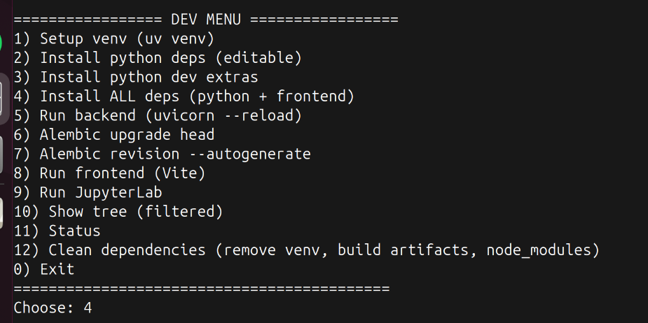

# 🩺 Обработка и анализ медицинских изображений
- [🩺 Обработка и анализ медицинских изображений](#%F0%9F%A9%BA-%D0%BE%D0%B1%D1%80%D0%B0%D0%B1%D0%BE%D1%82%D0%BA%D0%B0-%D0%B8-%D0%B0%D0%BD%D0%B0%D0%BB%D0%B8%D0%B7-%D0%BC%D0%B5%D0%B4%D0%B8%D1%86%D0%B8%D0%BD%D1%81%D0%BA%D0%B8%D1%85-%D0%B8%D0%B7%D0%BE%D0%B1%D1%80%D0%B0%D0%B6%D0%B5%D0%BD%D0%B8%D0%B9)
  - [📌 Итоговая тема проекта](#%F0%9F%93%8C-%D0%B8%D1%82%D0%BE%D0%B3%D0%BE%D0%B2%D0%B0%D1%8F-%D1%82%D0%B5%D0%BC%D0%B0-%D0%BF%D1%80%D0%BE%D0%B5%D0%BA%D1%82%D0%B0)
  - [👥 Состав команды](#%F0%9F%91%A5-%D1%81%D0%BE%D1%81%D1%82%D0%B0%D0%B2-%D0%BA%D0%BE%D0%BC%D0%B0%D0%BD%D0%B4%D1%8B)
  - [🎯 План работы](#%F0%9F%8E%AF-%D0%BF%D0%BB%D0%B0%D0%BD-%D1%80%D0%B0%D0%B1%D0%BE%D1%82%D1%8B)
  - [🔧 Технологии и инструменты](#%F0%9F%94%A7-%D1%82%D0%B5%D1%85%D0%BD%D0%BE%D0%BB%D0%BE%D0%B3%D0%B8%D0%B8-%D0%B8-%D0%B8%D0%BD%D1%81%D1%82%D1%80%D1%83%D0%BC%D0%B5%D0%BD%D1%82%D1%8B)
  - [🔗 Полезные ссылки](#%F0%9F%94%97-%D0%BF%D0%BE%D0%BB%D0%B5%D0%B7%D0%BD%D1%8B%D0%B5-%D1%81%D1%81%D1%8B%D0%BB%D0%BA%D0%B8)
  - [🔌 Инструкция по [локальному] запуску](#%F0%9F%94%8C-%D0%B8%D0%BD%D1%81%D1%82%D1%80%D1%83%D0%BA%D1%86%D0%B8%D1%8F-%D0%BF%D0%BE-%D0%BB%D0%BE%D0%BA%D0%B0%D0%BB%D1%8C%D0%BD%D0%BE%D0%BC%D1%83-%D0%B7%D0%B0%D0%BF%D1%83%D1%81%D0%BA%D1%83)
  - [Postman коллекция](#postman-%D0%BA%D0%BE%D0%BB%D0%BB%D0%B5%D0%BA%D1%86%D0%B8%D1%8F)

## 📌 Итоговая тема проекта
Разработка и исследование алгоритмов классификации медицинских изображений, а также создание сервиса для обработки изображений и выдачи прогноза.

---

## 👥 Состав команды

| № | ФИО                             | Контакт            |
|---|---------------------------------|--------------------|
| 1 | Махаммаджонов Суннатилла        | [@sunnatilla_m](https://t.me/sunnatilla_m) |
| 2 | Пащенко Леона Владимировна      | [@lpscc](https://t.me/lpscc)       |
| 3 | Иванов Дмитрий                  | [@John42galt](https://t.me/John42galt)     |
| 4 | Бартов Алексей Владимирович     | [@mr_rubar](https://t.me/mr_rubar)       |

**Номер команды:** 2  
**Куратор:** Булыгин Глеб [@jdbelg](https://t.me/jdbelg)  
[**Чат в телеграм**](https://t.me/c/2916140112/1)

---

## 🎯 План работы

| Этап                  | Содержание работы                                                       | Примерные сроки      |
|------------------------|------------------------------------------------------------------------|----------------------|
| Исследование           | Анализ статей и подходов, выбор датасета                               | Октябрь              |
| Подготовка данных      | Работа с датасетом, препроцессинг                                      | Ноябрь               |
| Моделирование          | Обучение "классических" моделей, эксперименты с архитектурами, подготовка MVP - простой интерфейс для демонстрации  достигнутого, **промежуточная защита**   | Декабрь              |
| Улучшение проекта      | Внедрение DL - ресерч и внедрение более продвинутых моделей                                                         | Январь - Февраль     |
| Сервис                 | Разработка веб-интерфейса для загрузки изображений и выдачи прогноза   | Март - Апрель        |
| Тестирование           | Проверка работы сервиса и моделей на новых данных, **подготовка к защите** | Май                  |
---


## 🔧 Технологии и инструменты
- 👨‍💻 Язык(и) разработки и библиотеки
  - ML-часть - [python](https://www.python.org/) (3.13 или под выбранные библиотеки в случае если какие-то будут необходимы, будет уточняться в процессе дизайна и реализации).
  -  Интерфейс - в минимальном наборе планируется использовать [Fastapi](https://fastapi.tiangolo.com/) + [Streamlit](https://streamlit.io/). в случае, если в процессе разработки сервиса будет принято решение о необходимости достаточно сложного пользовательского интерфейса (i.e. streamlit будет не достаточно) + [React.js](https://react.dev/) 
- 💾 Контроль версий и размещение кода: Весь код будет находиться на github
- 🖥️ Среда выполнения: Первые прототипы предполагается запускать локально и/или на google collab. В дальнейшем на этапе демо/inference - локальный запуск или аренда облачных мощностей, например - [digital ocean](https://www.digitalocean.com/)

## 🔗 Полезные ссылки
<details> 
    <summary>📁 Ресурсы для поиска датасета</summary> 

  - [kaggle](https://www.kaggle.com/) - Классика, имеются полуготовые решения
  - [roboflow](https://roboflow.com/) - Данные требуют доп обработки зато ресурс заточен под cv
</details>

---


## 🔌 Инструкция по [локальному] запуску
1. Установить [pyenv](https://github.com/pyenv/pyenv) | [pyenv-win](https://github.com/pyenv-win/pyenv-win)
2. Чтобы установить зависимости:
```bash
  pyenv install 3.13.7
  pyenv shell 3.13.7
  ./bootstrap.sh
```
Для установки зависимостей выберите пункт
`4) Install ALL deps (python + frontend)`

3. Запуск кода
   - jupyter:
     1. VS code:
        - Открыть ML.ipynb (если нужно)
        - Выберите окружение из venv
     2. Jupyter-notebook
          - Запустите `./bootstrap.sh`
          - Выберите 9
     3. Google collab:
          - На ваш страх и риск
   - сервис:
     - Запустите `./bootstrap.sh`
     - [при первом запуске] выберите  `6) Alembic upgrade head`
     - запустите бекенд - `5) Run backend (uvicorn --reload)`
     - запустите `./bootstrap.sh` **в другом терминале**, выберите `8) Run frontend (Vite)`
     - frontend: http://localhost:5173/
     - backend: http://127.0.0.1:8000/docs
## Postman коллекция
папка `/postman` содержит коллекцию для тестирования бекенда. Пожалуйста, при добавлении новых эндпоинтов пополните её необходимыми реквестами