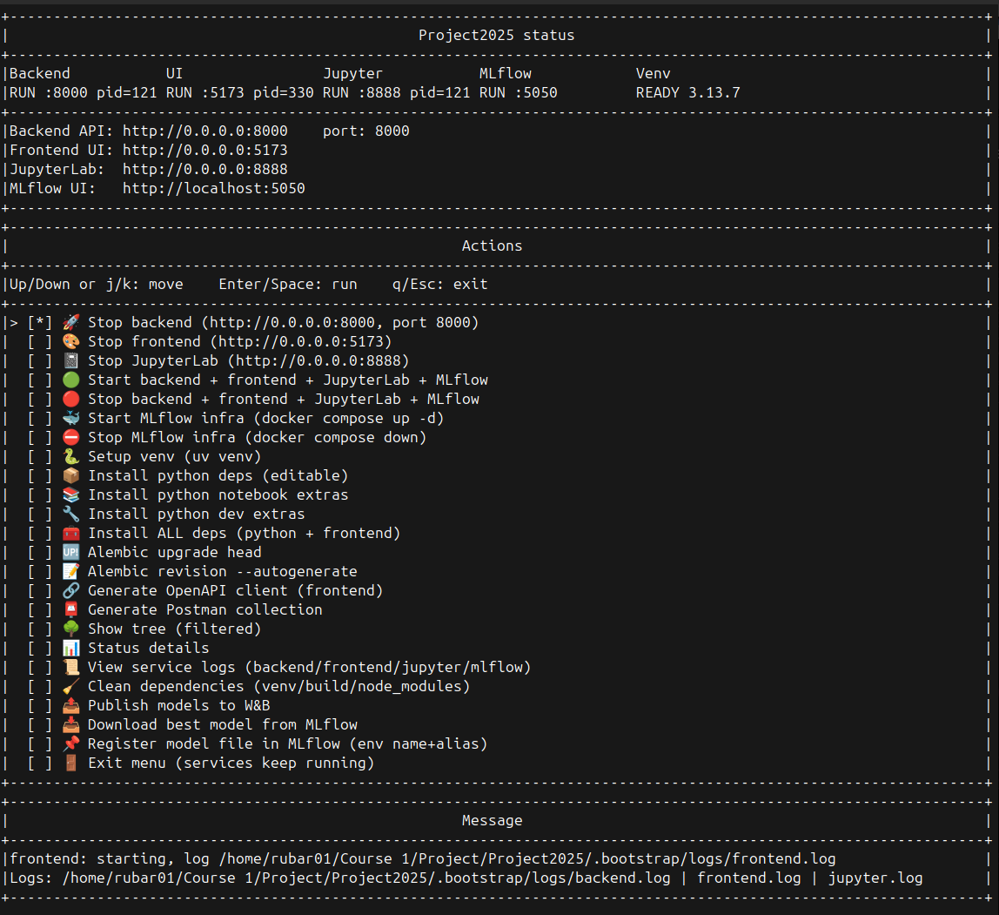

- [🩺 Обработка и анализ медицинских изображений (MURA)](#-обработка-и-анализ-медицинских-изображений-mura)
  - [🚀 Быстрый старт: запустить и поиграться](#-быстрый-старт-запустить-и-поиграться)
  - [🧭 Маршрут по чекпойнтам](#-маршрут-по-чекпойнтам)
  - [📚 Карта документации](#-карта-документации)
  - [👥 Состав команды](#-состав-команды)
  - [🎯 План работы](#-план-работы)
  - [🔧 Технологии и инструменты](#-технологии-и-инструменты)
  - [🔗 Полезные ссылки](#-полезные-ссылки)
  - [🔌 Полная инструкция по запуску](#-полная-инструкция-по-запуску)
    - [📓 Ноутбуки (чекпойнты 2, 3, 5)](#-ноутбуки-чекпойнты-2-3-5)
    - [🖥️ Сервис (чекпойнт 4)](#️-сервис-чекпойнт-4)
    - [📮 Postman](#-postman)

# 🩺 Обработка и анализ медицинских изображений (MURA)

Классификация рентгеновских снимков [MURA](https://stanfordmlgroup.github.io/competitions/mura/) на два класса — `normal` / `abnormal` — и веб-сервис, который принимает снимок и возвращает прогноз.

Репозиторий устроен как **путешествие по чекпойнтам**: от первого разведочного анализа данных до сервиса с MLflow. Ниже — точка входа «запустить и поиграться», карта маршрута по чекпойнтам и карта документации.

## 🚀 Быстрый старт: запустить и поиграться

Хотите просто поднять сервис и покидать в него рентген-снимки — вам сюда.

**Требования:** Linux, Python ≥ 3.13, Node.js ≥ 24, curl ≥ 8.

1. Установить Python 3.13.7 (через [pyenv](https://github.com/pyenv/pyenv) | [pyenv-win](https://github.com/pyenv-win/pyenv-win)):
   ```bash
   pyenv install 3.13.7
   pyenv shell 3.13.7
   ```
2. Поставить зависимости: запустить `./bootstrap.sh` — откроется интерактивное меню (навигация — стрелки `↑`/`↓` или `j`/`k`, запуск пункта — `Enter`/`Space`, выход — `q`/`Esc`). Выбрать пункт `🧰 Install ALL deps (python + frontend)`:
   ```bash
   ./bootstrap.sh
   ```
   
3. Создать базу данных (только при первом запуске) — пункт `🆙 Alembic upgrade head`.
4. Запустить бэкенд — пункт `🚀 Start backend`.
5. Запустить фронтенд — пункт `🎨 Start frontend`.

> 💡 Сервисы запускаются в фоне прямо из меню — отдельный терминал не нужен. Пункт `🟢 Start backend + frontend + JupyterLab + MLflow` поднимает все сервисы разом.

Открыть в браузере:
- 🌐 Фронтенд: <http://localhost:5173/>
- 📄 API-документация (Swagger): <http://127.0.0.1:8000/docs>

Полная инструкция (включая запуск ноутбуков) — в разделе «Полная инструкция по запуску» ниже. Как устроен сам сервис — в [README сервиса](service/README.md).

## 🧭 Маршрут по чекпойнтам

Проект развивался по чекпойнтам — каждый следующий строится на предыдущем. Читать удобно по порядку:

| Чекпойнт | Этап | Что внутри | Открыть |
|:---:|---|---|---|
| **2** | 🔍 EDA | Первичный разведочный анализ: что за данные, пути, размеры снимков, распределения классов | [EDA.ipynb](EDA.ipynb) |
| **3** | 🤖 Классические ML | Доработка EDA, препроцессинг и простые модели (HOG + PCA + линейные классификаторы, XGBoost) | [ML.ipynb](ML.ipynb) |
| **4** | 🖥️ Сервис | FastAPI-бэкенд + React-фронтенд: загрузка снимков, инференс, история, статистика, авторизация | [service/README.md](service/README.md) |
| **5** | 📈 ML-эксперименты | Попытки улучшить классические ML-модели | [ML_Experiments.ipynb](ML_Experiments.ipynb) |
| **6** | 🧠 Deep Learning | CNN baseline, DenseNet121, ResNet50/101, DINOv2 — эксперименты и сравнение | [DL_Experiments.md](DL_Experiments.md) |
| **7** | 🚀 MLflow | Финальная модель, воспроизводимый MLflow-стек, встраивание обучения в сервис | [MLflow_Checkpoint_MURA.md](MLflow_Checkpoint_MURA.md) |

## 📚 Карта документации

| Документ | О чём | Чекпойнт |
|---|---|:---:|
| [service/README.md](service/README.md) | Архитектура сервиса, эндпоинты, роли, запуск | 4 |
| [DL_Experiments.md](DL_Experiments.md) | Эксперименты с глубоким обучением | 6 |
| [MLflow_Checkpoint_MURA.md](MLflow_Checkpoint_MURA.md) | MLflow-чекпойнт и финальная модель | 7 |
| [docs/error_analysis.md](docs/error_analysis.md) | Анализ ошибок финальной DINOv2-модели | 7 |
| [docs/robustness_analysis.md](docs/robustness_analysis.md) | Проверка устойчивости к искажениям | 7 |
| [docs/model_deploy_from_gdrive.md](docs/model_deploy_from_gdrive.md) | Деплой модели: Google Drive → MLflow → бэкенд | 7 |
| [postman/](postman/) | Готовая Postman-коллекция для тестирования API | 4 |

---

## 👥 Состав команды

| № | ФИО                             | Контакт            |
|---|---------------------------------|--------------------|
| 1 | Махаммаджонов Суннатилла        | [@sunnatilla_m](https://t.me/sunnatilla_m) |
| 2 | Пащенко Леона Владимировна      | [@lpscc](https://t.me/lpscc)       |
| 3 | Иванов Дмитрий                  | [@John42galt](https://t.me/John42galt)     |
| 4 | Бартов Алексей Владимирович     | [@mr_rubar](https://t.me/mr_rubar)       |

**Номер команды:** 2  
**Куратор:** Булыгин Глеб [@jdbelg](https://t.me/jdbelg)  
[**Чат в телеграм**](https://t.me/c/2916140112/1)

---

## 🎯 План работы

| Этап                  | Содержание работы                                                       | Примерные сроки      |
|------------------------|------------------------------------------------------------------------|----------------------|
| Исследование           | Анализ статей и подходов, выбор датасета                               | Октябрь              |
| Подготовка данных      | Работа с датасетом, препроцессинг                                      | Ноябрь               |
| Моделирование          | Обучение "классических" моделей, эксперименты с архитектурами, подготовка MVP - простой интерфейс для демонстрации  достигнутого, **промежуточная защита**   | Декабрь              |
| Улучшение проекта      | Внедрение DL - ресерч и внедрение более продвинутых моделей                                                         | Январь - Февраль     |
| Сервис                 | Разработка веб-интерфейса для загрузки изображений и выдачи прогноза   | Март - Апрель        |
| Тестирование           | Проверка работы сервиса и моделей на новых данных, **подготовка к защите** | Май                  |

---


## 🔧 Технологии и инструменты
- 👨‍💻 Язык(и) разработки и библиотеки
  - ML-часть - [python](https://www.python.org/) (3.13 или под выбранные библиотеки в случае если какие-то будут необходимы, будет уточняться в процессе дизайна и реализации).
  -  Интерфейс - в минимальном наборе планируется использовать [Fastapi](https://fastapi.tiangolo.com/) + [Streamlit](https://streamlit.io/). в случае, если в процессе разработки сервиса будет принято решение о необходимости достаточно сложного пользовательского интерфейса (i.e. streamlit будет не достаточно) + [React.js](https://react.dev/) 
- 💾 Контроль версий и размещение кода: Весь код будет находиться на github
- 🖥️ Среда выполнения: Первые прототипы предполагается запускать локально и/или на google collab. В дальнейшем на этапе демо/inference - локальный запуск или аренда облачных мощностей, например - [digital ocean](https://www.digitalocean.com/)

## 🔗 Полезные ссылки
<details> 
    <summary>📁 Ресурсы для поиска датасета</summary> 

  - [kaggle](https://www.kaggle.com/) - Классика, имеются полуготовые решения
  - [roboflow](https://roboflow.com/) - Данные требуют доп обработки зато ресурс заточен под cv
</details>

---


## 🔌 Полная инструкция по запуску

Подготовка окружения (один раз):

1. Установить [pyenv](https://github.com/pyenv/pyenv) | [pyenv-win](https://github.com/pyenv-win/pyenv-win) и Python 3.13.7:
   ```bash
   pyenv install 3.13.7
   pyenv shell 3.13.7
   ```
2. Запустить `./bootstrap.sh` и выбрать пункт `🧰 Install ALL deps (python + frontend)`. Навигация по меню — стрелки `↑`/`↓` или `j`/`k`, запуск пункта — `Enter`/`Space`.

   

### 📓 Ноутбуки (чекпойнты 2, 3, 5)

- **VS Code:** открыть нужный ноутбук ([EDA.ipynb](EDA.ipynb), [ML.ipynb](ML.ipynb), [ML_Experiments.ipynb](ML_Experiments.ipynb)) и выбрать окружение из `venv`.
- **Jupyter:** запустить `./bootstrap.sh` и выбрать пункт `📓 Start JupyterLab`.
- **Google Colab:** на ваш страх и риск.

### 🖥️ Сервис (чекпойнт 4)

Через `./bootstrap.sh`:

- `🆙 Alembic upgrade head` — при первом запуске (создаёт базу данных);
- `🚀 Start backend` — бэкенд, <http://127.0.0.1:8000/docs>;
- `🎨 Start frontend` — фронтенд, <http://localhost:5173/>.

Сервисы работают в фоне, поэтому бэкенд и фронтенд запускаются из одного меню, без отдельного терминала.

Подробнее об устройстве сервиса, эндпоинтах и ролях — в [README сервиса](service/README.md).

### 📮 Postman

Папка [`postman/`](postman/) содержит коллекцию для тестирования бэкенда. При добавлении новых эндпоинтов, пожалуйста, пополняйте её соответствующими запросами.
