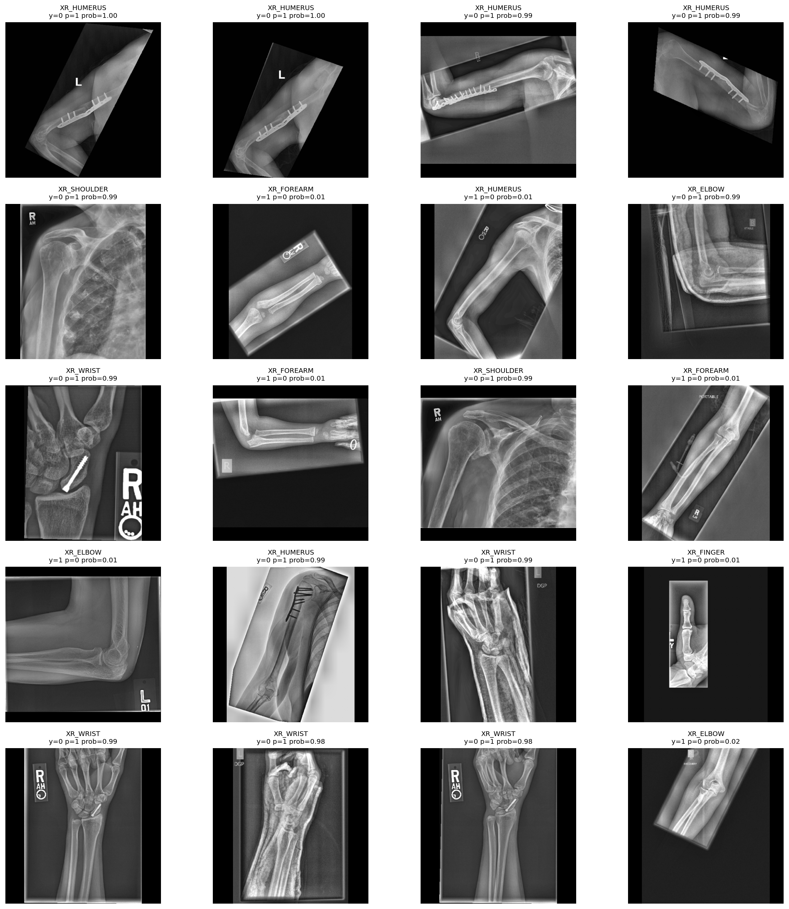

# Анализ ошибок DINOv2 на MURA

> 🧭 [README](../README.md) · [Чекпойнт 7 — MLflow](../MLflow_Checkpoint_MURA.md) · **Анализ ошибок**

Модель: `facebook/dinov2-large`.

Порог бинаризации выбран на internal validation по study-level предсказаниям: `0.480`.
На test split из official `valid/` качество составило:

| Уровень | Accuracy | F1 | Cohen's kappa | ROC-AUC | PR-AUC |
|---|---:|---:|---:|---:|---:|
| Image-level | 0.841 | 0.824 | 0.680 | 0.903 | 0.912 |
| Study-level | 0.853 | 0.827 | 0.700 | 0.911 | 0.911 |

Основные CSV для этого разбора:

- `all_test_errors.csv` - полный список `509` неверных image-level предсказаний;
- `error_counts_by_anatomy.csv` - количество ошибок по анатомии и типу ошибки;
- `error_examples_10_20.csv` - первые 20 строк из `all_test_errors.csv`, то есть самые уверенные неверные image-level предсказания;
- `robustness_report.csv` и `robustness_predictions.csv` - чувствительность к простым искажениям.

Важно: MURA содержит метки уровня исследования (`study1_positive` / `study1_negative`), а не локализацию патологии на каждом снимке. Поэтому image-level ошибка не всегда означает, что именно этот снимок визуально содержит или не содержит патологию. Это ограничение критично для интерпретации false negative на отдельных проекциях.

## Общая картина ошибок

На test image-level было `3197` изображений: `1530` positive и `1667` negative. В `all_test_errors.csv` сохранено `509` ошибок (`15.9%`):

- `335` false negative: positive изображение/исследование предсказано как normal;
- `174` false positive: negative изображение/исследование предсказано как abnormal.

False negative доминируют: модель чаще пропускает abnormal-класс, чем ошибочно поднимает normal-класс. Это согласуется с тем, что часть патологий MURA может быть тонкой, видимой только на одной проекции или закодированной на уровне всего исследования.

Распределение ошибок по анатомии:

| Anatomy | Images | False negative | False positive | Total errors | Error rate |
|---|---:|---:|---:|---:|---:|
| XR_SHOULDER | 563 | 56 | 66 | 122 | 21.7% |
| XR_FINGER | 461 | 61 | 26 | 87 | 18.9% |
| XR_HAND | 460 | 63 | 22 | 85 | 18.5% |
| XR_WRIST | 659 | 69 | 16 | 85 | 12.9% |
| XR_ELBOW | 465 | 41 | 17 | 58 | 12.5% |
| XR_FOREARM | 301 | 35 | 9 | 44 | 14.6% |
| XR_HUMERUS | 288 | 10 | 18 | 28 | 9.7% |

Главный вывод по анатомиям:

1. `XR_SHOULDER` - самая проблемная зона и по абсолютному числу ошибок, и по доле ошибок. Для плеча характерны наложения грудной клетки, ключицы, лопатки, разные проекции и высокая визуальная вариативность.
2. `XR_HAND`, `XR_FINGER`, `XR_WRIST` дают много false negative. Вероятная причина - мелкие кости, тонкие линии переломов, наложения и inherited study-level labels.
3. `XR_HUMERUS` имеет низкий общий error rate, но среди выбранных уверенных ошибок много negative studies с металлическими конструкциями. Модель явно использует металл как сильный признак abnormal.

## Типичные категории ошибок

1. **False negative на тонких или view-dependent находках.** Positive study может содержать патологию, которая видна только на другой проекции или требует клинической разметки. При image-level обучении такая метка наследуется всеми снимками study, даже если конкретное изображение выглядит почти нормальным.

2. **False positive на металлических конструкциях.** В selected examples есть negative studies с пластинами, винтами или послеоперационными изменениями. Модель уверенно относит такие снимки к abnormal, потому что в обучении металл часто коррелирует с переломами/операциями. Но официальный label может оставаться negative, если в отчете нет актуальной патологии.

3. **False positive на гипсе, шинах, маркерах, нестандартной укладке и crop/padding.** Такие артефакты меняют текстуру и геометрию снимка, создавая визуальные паттерны, похожие на abnormal-класс.

4. **Ошибки сложных анатомий с сильным наложением структур.** Особенно это видно для `XR_SHOULDER`: наложение ребер, лопатки, ключицы и мягких тканей может выглядеть как патологический паттерн даже на negative study.

5. **Не пороговые, а уверенные ошибки.** В полном наборе ошибок только `38` из `509` находятся в зоне `margin_to_threshold <= 0.05`. В выбранных 20 примерах все ошибки уверенные: `confidence >= 0.98`, расстояние до порога от `0.463` до `0.516`. Поэтому простая смена threshold не исправит эти кейсы без заметных побочных ошибок.

## Разбор 20 неверных предсказаний

Ниже разобраны строки из `error_examples_10_20.csv`. Этот файл совпадает с первыми 20 строками `all_test_errors.csv`, отсортированного по уверенности ошибки. Это не случайная выборка, а самые уверенные ошибки, поэтому она хорошо показывает устойчивые failure modes модели.

| # | Study / image | True -> Pred | Prob | Категория | Причина и возможность корректировки |
|---:|---|---:|---:|---|---|
| 1 | `XR_HUMERUS/patient11671/study1_negative/image3` | 0 -> 1 | 0.996 | FP, металл | Видна пластина/винты. Модель считает металл abnormal-признаком. Автоматически менять label нельзя: official label negative может означать отсутствие актуальной патологии, а не отсутствие старой операции. |
| 2 | `XR_HUMERUS/patient11671/study1_negative/image1` | 0 -> 1 | 0.996 | FP, металл | Та же study, другая проекция. Ошибка повторяется на уровне исследования. Исправление возможно только через ручную ревизию label или отдельный признак `postoperative hardware`. |
| 3 | `XR_HUMERUS/patient11339/study1_negative/image2` | 0 -> 1 | 0.995 | FP, металл | Пластина/винты создают очень сильный abnormal cue. CSV не дает оснований считать official label ошибочным. |
| 4 | `XR_HUMERUS/patient11671/study1_negative/image2` | 0 -> 1 | 0.994 | FP, металл | Третий снимок той же negative study. Проблема не в шуме одного изображения, а в систематическом shortcut модели. |
| 5 | `XR_SHOULDER/patient11601/study2_negative/image1` | 0 -> 1 | 0.993 | FP, плечо/наложения | Плечо снято с сильным наложением грудной клетки и мягких тканей. Модель переоценивает сложный фон как abnormal. Без радиологического заключения корректировать label нельзя. |
| 6 | `XR_FOREARM/patient11402/study1_positive/image1` | 1 -> 0 | 0.009 | FN, subtle finding | Positive study, но конкретная проекция визуально не дает явного abnormal-сигнала для модели. Возможная причина - патология видна на другой проекции или слишком тонкая. Автоматическая корректировка невозможна. |
| 7 | `XR_HUMERUS/patient11641/study2_positive/image1` | 1 -> 0 | 0.010 | FN, inherited study label | На изображении нет очевидного для модели сильного признака abnormal. Такую строку нельзя relabel как negative без просмотра всего study и отчета врача. |
| 8 | `XR_ELBOW/patient11763/study1_negative/image2` | 0 -> 1 | 0.990 | FP, шина/укладка | В кадре есть внешние элементы и нестандартная геометрия. Модель реагирует на артефакты фиксации/позиционирования как на abnormal. Исправление - только обучающее: добавить hard negative с такими артефактами. |
| 9 | `XR_WRIST/patient11360/study1_negative/image2` | 0 -> 1 | 0.990 | FP, металл | Видимый винт в области кисти/запястья. Это объяснимый shortcut: металл часто встречается в abnormal cases. Label менять нельзя без знания clinical target. |
| 10 | `XR_FOREARM/patient11402/study1_positive/image2` | 1 -> 0 | 0.010 | FN, repeated study | Вторая ошибка той же positive study, что и пример 6. Вероятно, модель не видит нужный abnormal-паттерн ни на одной из сохраненных проекций. Требуется radiology review или lesion-level annotation. |
| 11 | `XR_SHOULDER/patient11601/study2_negative/image3` | 0 -> 1 | 0.989 | FP, плечо/наложения | Повторная ошибка той же negative shoulder study. Простая смена threshold не поможет: вероятность почти 0.99. Нужны hard negatives по плечу и калибровка по анатомии. |
| 12 | `XR_FOREARM/patient11429/study1_positive/image2` | 1 -> 0 | 0.011 | FN, subtle finding | Positive forearm, но модель дает почти нулевую вероятность abnormal. Вероятная причина - слабый или локальный признак, который теряется при resize/pad. Корректировка label невозможна по одному CSV. |
| 13 | `XR_ELBOW/patient11824/study1_positive/image1` | 1 -> 0 | 0.013 | FN, one-view ambiguity | Для локтя abnormal может проявляться косвенно: линия перелома, выпот, fat-pad sign. Без локализации модель может пропустить такой сигнал. Автоматически исправлять нельзя. |
| 14 | `XR_HUMERUS/patient11378/study1_negative/image1` | 0 -> 1 | 0.987 | FP, металл | Еще один negative humerus с пластиной/винтами. Это подтверждает отдельную категорию false positive на postoperative hardware. |
| 15 | `XR_WRIST/patient11326/study1_negative/image1` | 0 -> 1 | 0.986 | FP, проекция/качество | Снимок запястья имеет сложное наложение костей и нестандартную укладку. Модель уверенно ошибается, поэтому threshold-коррекция не подходит. |
| 16 | `XR_FINGER/patient11913/study1_positive/image1` | 1 -> 0 | 0.014 | FN, мелкая анатомия | Узкий crop пальца и маленький размер патологического паттерна после resize могут скрыть сигнал. Для исправления нужны более детальные labels или crop-aware обучение. |
| 17 | `XR_WRIST/patient11360/study1_negative/image4` | 0 -> 1 | 0.985 | FP, repeated hardware study | Та же negative wrist study, что и пример 9. Даже если на конкретной проекции металл/аномалия менее заметны, модель уже реагирует на study-specific визуальный паттерн. |
| 18 | `XR_WRIST/patient11326/study1_negative/image2` | 0 -> 1 | 0.985 | FP, артефакты/наложение | Повторная ошибка той же negative wrist study. Похоже на реакцию на качество проекции, наложение и текстуру, а не на пороговую неопределенность. |
| 19 | `XR_WRIST/patient11360/study1_negative/image3` | 0 -> 1 | 0.983 | FP, repeated hardware study | Третья ошибка той же wrist study. Это показывает, что image-level список переоценивает независимость ошибок: несколько строк могут быть одним study-level failure. |
| 20 | `XR_ELBOW/patient11806/study1_positive/image1` | 1 -> 0 | 0.017 | FN, subtle finding | Positive elbow с очень низкой abnormal probability. Вероятная причина - тонкая находка или метка всего исследования. Автоматическая корректировка невозможна без врача. |

Сетка выбранных ошибок:

## Повторяемость ошибок на уровне study

В 20 выбранных строках только `13` уникальных studies. Повторяются:

- `XR_HUMERUS/patient11671/study1_negative` - 3 ошибки;
- `XR_SHOULDER/patient11601/study2_negative` - 2 ошибки;
- `XR_FOREARM/patient11402/study1_positive` - 2 ошибки;
- `XR_WRIST/patient11360/study1_negative` - 3 ошибки;
- `XR_WRIST/patient11326/study1_negative` - 2 ошибки.

Это важно для интерпретации: несколько image-level ошибок часто являются одной study-level ошибкой. Поэтому корректнее анализировать не только отдельные снимки, но и группы снимков одного исследования.